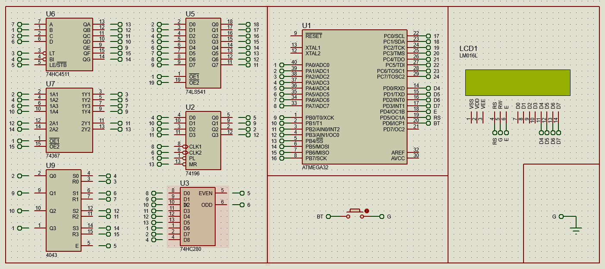

# IC Tester Based on ATmega32

An **Integrated Circuit (IC) Tester** built with the ATmega32 microcontroller to verify the functionality of various ICs, including logic gates, flip-flops, shift registers, and counters. The tester compares the IC's behavior against predefined truth tables and provides feedback via a 16x2 LCD display.

## Features
- **Supported ICs**:
  - 74541 (Buffer/Line Driver)
  - 7486 (XOR Gate)
  - 74280 (Parity Generator/Checker)
  - 74367 (Tri-State Buffer)
  - 74196 (Synchronous 4-bit Up/Down Counter)
  - 4081 (AND Gate)
  - 4043 (Quad NOR R/S Latch)
  - 744511 (7-Segment Decoder)
- **Real-Time Feedback**:
  - Displays results on a 16x2 LCD.
  - Detects and notifies if the IC is valid or faulty.
- **Push-Button Interface**:
  - Simple one-button testing mechanism.
- **Metadata Storage**:
  - Stores IC pin configurations, input/output details, and truth tables.

## How It Works
1. **Insert the IC**: Place the IC in the ZIF socket or the assigned slot.
2. **Press the Test Button**: The ATmega32 performs logic verification.
3. **View Results**: The 16x2 LCD displays the testing outcome (PASS/FAIL).

## Schematic Diagram
Below is the hardware schematic of the IC tester:



> Note: Replace the `schematics/ic_tester_schematic.png` path with the correct relative path to your schematic image in the repository.

## Technical Details
- **Microcontroller**: ATmega32 programmed in C.
- **Truth Table Storage**: Data stored as structured arrays in flash memory.
- **Pin State Verification**: Utilizes GPIO pins for input/output testing.

## Applications
- Educational tool for learning about digital ICs.
- Debugging and repairing logic circuits.
- Quick IC functionality tests for labs and workshops.

## Repository Contents
- **`/src`**: Source code for the firmware written in C.
- **`/schematics`**: Circuit diagrams and wiring details.
- **`/docs`**: Detailed documentation and usage instructions.
- **`/metadata`**: Example truth tables and IC configurations.

## Getting Started
1. Clone the repository:
   ```bash
   git clone https://github.com/MahmoudKhaled25/IC_Tester.git
   cd ic-tester
2. Flash the firmware onto the ATmega32 using your preferred programmer.
3. Connect the hardware as per the circuit schematics.
4. Insert an IC, press the button, and view the results on the LCD.
